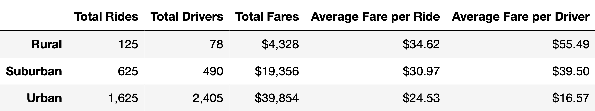
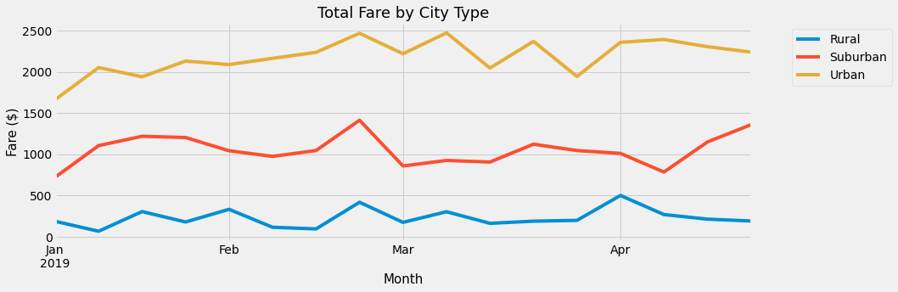

# PyBer_Analysis

## Overview of the analysis: 

The analysis is carried out at the request of ride-sharing app company PyBer. The purpose of the project is to create a summary dataframe of the ride-sharing data by city type and create a multiple-line graph that shows the total weekly fares for each city type, which will improve access to ride-sharing services and determine affordability for underserved areas.

The analysis is based on the following datasets:

[city_data.csv](https://github.com/sharof17/PyBer_Analysis/blob/main/Resources/city_data.csv)

[ride_data.csv](https://github.com/sharof17/PyBer_Analysis/blob/main/Resources/ride_data.csv)

## Results: 

### Summary DataFrame
In order to perform the analysis, it is important to compare the data of each city type. Therefore, it was decided to generate the following table, using two datasets above:

*Summary DataFrame*

From the table it is clear that there are much more rides, drivers in urban area than in other areas. And, the least number of rides and drivers is in rural area. However, the amounts of average fare per ride and average fare per driver are much less in urban area. It means that drivers in rural area get paid more for each ride. In rural, suburban and urban areas drivers, in average do 1.6, 1.3 and 0.7 rides, respectively. All average figures of urban area are the least. The second least average figures are in suburban area. And the highest averages belong to rural area. However, it is important to keep in mind, that this table does not show distance covered by drivers. Long distance rides would explain why in rural and suburban areas average fare per ride is much higher than in urban city type.

### Fare Summary
Using the summary dataframe, the following chart was generated:

*Fare Summary*

This chart illustrates weekly sum of fares for each city type (January to May, 2019). Chart shows that total fares in all city types were fairly steady. There were not dynamic changes. Urban area's total weekly fares from about $1,660 to $2,500. In suburban area total weekly fares were from about $720 to almost $1,500. And, in rural area this indicator was from about $70 to $500. Minimum points for urban and suburban city types were in the beginning of January. The minimum point of rural city type was in the second week of January, $68 which is almost two times of average fare per ride ($34.62).  It means, that week there were about two rides. Even in the best week the there were  about 15 rides ($500 / $34.62 =14.4) in the rural area. The urban and suburban city types are in the first and second places, respectively. 

## Summary: 

The following recommendations should be considered before accessing to ride-sharing services in underserved areas:
    - Territory of rural and suburban areas and mileage distance covered by drivers should be considered, to check why average fare for each ride in rural and suburban areas is higher than in urban area;
    - Population of all areas should be considered as well. The correlation between territory and population would show better picture;
    - Due to low demand, probably Rural area is not worth accessing.
